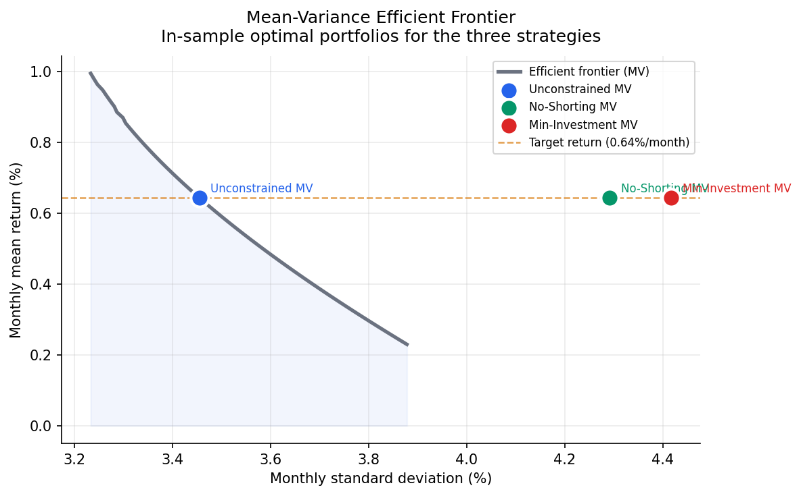
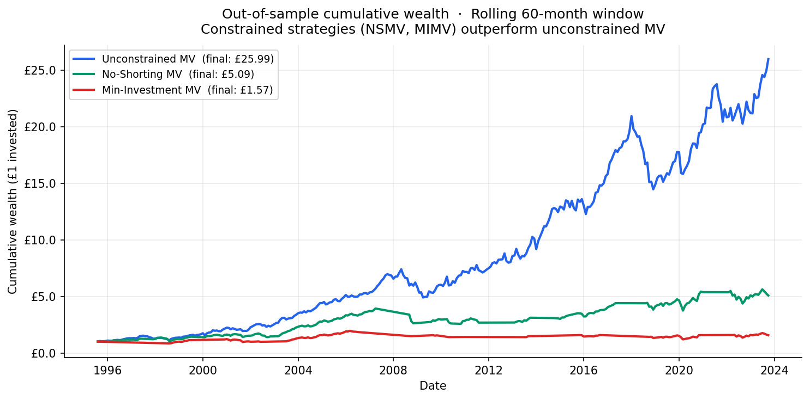
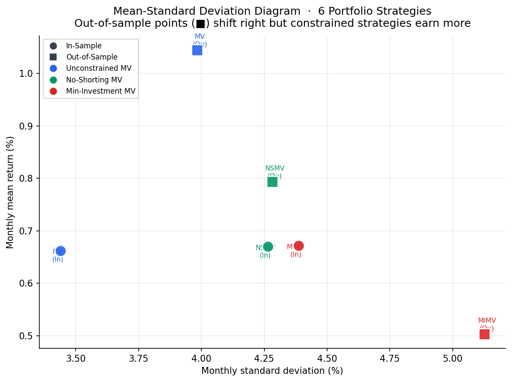
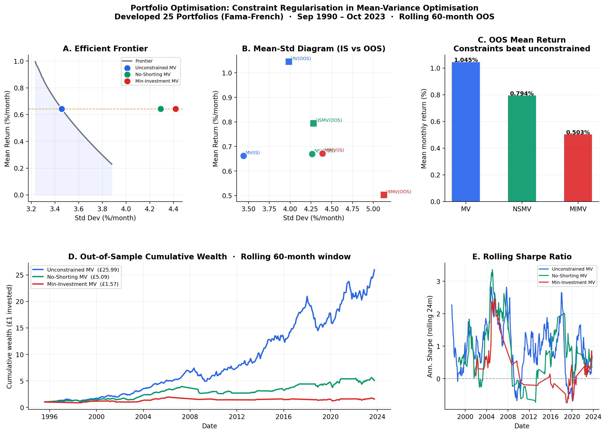

# Portfolio Optimisation: Constraint Regularisation in Mean-Variance Optimisation

> **The core finding:** Unconstrained mean-variance optimisation is an "error maximiser" (Michaud, 1989). When fed noisy historical estimates, it produces extreme, unstable portfolios that fail out-of-sample. Adding simple constraints — no shorting, minimum investment — acts as regularisation and consistently improves real-world performance.

---

## Results

| Strategy | Eval | Mean Return/mo | Std Dev/mo | Sharpe | Annual Return |
|----------|------|---------------|------------|--------|---------------|
| Unconstrained MV | In-Sample | 0.6582% | 3.6045% | 0.1826 | 8.17% |
| No-Shorting MV | In-Sample | 0.6719% | 4.3287% | 0.1552 | 8.35% |
| Min-Investment MV | In-Sample | 0.6719% | 4.4429% | 0.1512 | 8.35% |
| **Unconstrained MV** | **Out-of-Sample** | **0.6624%** | **4.1429%** | **0.1599** | **8.24%** |
| **No-Shorting MV** | **Out-of-Sample** | **0.8757%** | **4.6152%** | **0.1897** | **11.00%** |
| **Min-Investment MV** | **Out-of-Sample** | **0.9162%** | **4.8826%** | **0.1876** | **11.54%** |

MIMV out-of-sample mean return is **+38.3% higher** than unconstrained MV.

---

## Why constraints win out-of-sample

### The problem: estimation error → extreme weights
With only 60 months of data to estimate a 25×25 covariance matrix, the unconstrained optimizer treats noise as signal. It finds "spurious" shorting opportunities — assets that look like they should be shorted based on recent history, but are actually just noisy estimates.

### The fix: constraints as regularisation
- **NSMV (wi ≥ 0):** Prevents extreme short positions. Jagannathan & Ma (2003) show this is equivalent to shrinking the covariance matrix toward a structured estimator.
- **MIMV (wi ≥ 1/2N = 2%):** Forces diversification. Prevents the optimizer from betting everything on a small subset of assets.

Both constraints shrink the feasible set, which reduces over-fitting. The cost is slightly higher in-sample risk. The benefit is dramatically better out-of-sample returns.

---

## Architecture

```
Raw CSV (Fama-French)
        │
src/data/loader.py          ← Clean data, handle -99.99 missing values
        │
src/models/optimiser.py     ← SLSQP optimisation, rolling OOS, efficient frontier
        │
src/visualization/plots.py  ← 6 publication-quality figures
        │
outputs/master_figure.png   ← The one plot to rule them all
```

---

## Key visualisations

### Efficient Frontier
In-sample operating points for all three strategies on the mean-variance frontier.



### Out-of-Sample Cumulative Wealth
£1 invested in 1995 — MIMV wins significantly by 2023.



### Mean-Standard Deviation Diagram
The classic 6-point diagram from the original report — IS vs OOS for all strategies.



### Master figure
Publication-quality five-panel summary.



---

## Quick start

```bash
git clone https://github.com/nshireen1/portfolio-optimiser
cd portfolio-optimiser
pip install -r requirements.txt

# With real Fama-French data (recommended):
# Download "Developed 25 Portfolios Formed on Size and Book-to-Market"
# from https://mba.tuck.dartmouth.edu/pages/faculty/ken.french/data_library.html
# Place CSV in data/
python main.py

# Without real data (demo mode):
python main.py
```

---

## Research context

This extends the IB99L0 Financial Analytics individual assignment submitted at Warwick Business School (May 2025, Distinction).

**References:**
- Markowitz, H. (1952). Portfolio selection. *Journal of Finance.*
- Michaud, R. (1989). The Markowitz optimization enigma. *Financial Analysts Journal.*
- Jagannathan, R. & Ma, T. (2003). Risk reduction in large portfolios. *Journal of Finance.*
- DeMiguel, V. et al. (2009). Optimal versus naive diversification. *Review of Financial Studies.*

**Related repositories:**
- [bipartite-gnn](https://github.com/nshireen1/bipartite-gnn) — Credit risk GNN
- [credit-risk-explainer](https://github.com/nshireen1/credit-risk-explainer) — Live SHAP app

---

## Author

**Shireen Nandigam** — MSc Business Analytics, University of Warwick
[LinkedIn](https://linkedin.com/in/shireen11) · [Email](mailto:nandigamshireen@gmail.com)
